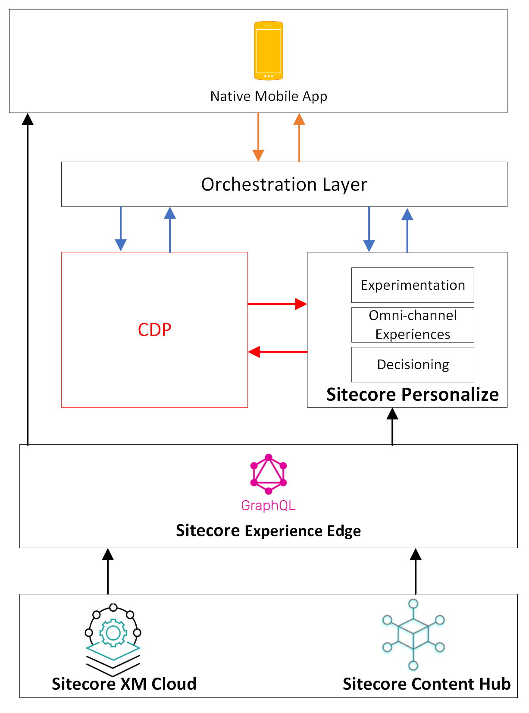

# Sitecore Personalize and Mobile App project series
Welcome to the Sitecore Personalize and Mobile App Project Series repository! 📱✨

This repository is designed to help developers and architects seamlessly integrate Sitecore Personalize with mobile applications. Whether you're building personalized user experiences or exploring advanced use cases, this collection provides all the resources you need to get started.

What’s Inside?
Reference Architectures: Sample architectures for integrating Sitecore Personalize with mobile apps.
Code Walkthroughs: Step-by-step guides to implement key personalization features.
Best Practices: Tips for designing scalable and efficient integrations.
Sample Use Cases: Real-world scenarios showcasing Sitecore Personalize in action.
This repo is perfect for anyone looking to enhance mobile user engagement through tailored content and experiences. Start exploring and level up your Sitecore integration game! 🚀

# Reference architecture #1
Below is the high level architectues for this solution

	

# Other code snippets
Don't forget to check out our [GitHub Gists page](https://gist.github.com/JuliusAngwenyi)

